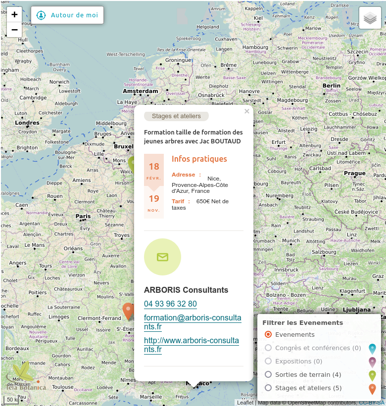
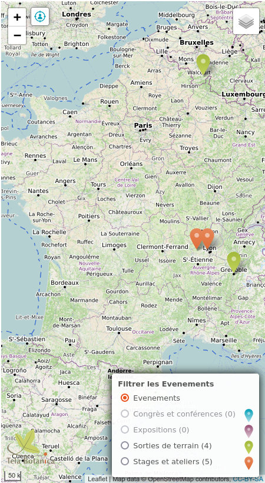
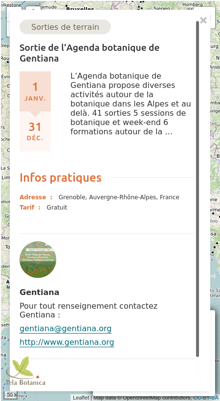

# Tela Botanica Maps

## Description

Displays data from given sources on a leaflet map with multiple map layers.  
Allows filtering on sources, and categories, from each source.  
Displays related information in (responsive) popup from each marker.  
Designed for integration in an iframe.  

## Install

1. Clone the repository, copy & paste _/config/config.ini.default.php_ as _config.ini.php_, then change the settings, if necessary.

2. Copy & paste _/assets/scripts/config.default.js_ as _config.js_, then change the settings, particulary:
- `sources`
- `sourceList`
- `sourceClasses`
- `profileURL`

## Usage

**You can use some parameters to customize the map** :
- `logo` : an image url for your logo to be displayed on bottom left of the map
- `title` : a title for your map
- `website_url` : the link of your logo to your website
- `zoom` : an integer between 4 and 18  

To add some more custom parameters you will have to extend the app see **Extend** section below.

## Extend

### If you added some sources, you will have to:
- Implement your own [Source] js handler classe for each  
I recommend to copy the _evenements.js_ code and adapt, **you have to implement all methods in "_required implementation_" part (see comments), and call the file like the class name (lower case)**.
- Add it in config.js `sourceClasses` object.
- Maybe adapt the code in tb-maps.js if necessary
- Add some css in _asset/css/[your source].css_
- Maybe handle your query string params in Tbmaps.php if needed  

Don't forget to load all of these in _/templates/tbmaps.php_

## Default source

Default source is Tela-botanica (geolocated) post events called ***evenements*** (Évènements): 
* Page :  [https://www.tela-botanica.org/evenements/](https://www.tela-botanica.org/evenements/).
* Service called (wp rest api) for 1000 results :  [http://localhost/site_tela/wp-json/wp/v2/posts?status=publish&categories=26,27,28,29&per_page=1000&order_by=modified&order=desc](http://localhost/site_tela/wp-json/wp/v2/posts?status=publish&categories=26,27,28,29&per_page=1000&order_by=modified&order=desc).

### Post Events source Requirements (wordpress Tela Botanica website)

1. Check that requested categories ids in query string are all the children of category ***evenements*** (currently category evenement id is "25", requested categories are "26" to "29").

2. **Loading 1000 post events can be long** :turtle: **and may fail** so :
- make sure that _wp-content/themes/telabotanica/inc/rest-api-posts-per-page.php_ exists and registered in _functions.php_ (alows param `per_page` to request more than 100 results)
- Make sure the ***WP REST Cache*** plugin is installed, active and properly configured
- To load 1000 post events it may be necessary to prime the cash by runing the request separately in a browser several times or try to load less data (800 or 500 seems to work). And roll the dice :game_die:.  
	Note that :  
		* you may have to delete some cash records during the process : unsuccessful requests may have been cashed  
		* after the request succeeds, delete all other request from the cash  
		* sometimes when the cash times out you have to repeat this operation from the beginning  

3. **Some custom fields are required in the returned data** :
- A field ***category*** listing category id, name and slug : make sure that _wp-content/themes/telabotanica/inc/rest-api-posts-category-hierarchy.php_ exists and registered in _functions.php_
- A field ***acf*** Advanced Custom Fields, acf meta data object of the post :  make sure that _wp-content/themes/telabotanica/inc/rest-api-posts-acf.php_ exists and registered in _functions.php_

## Screenshots

- ***Large screens*** :  

- ***Small screens*** :  

- ***Small screens with overlay popup*** :  

